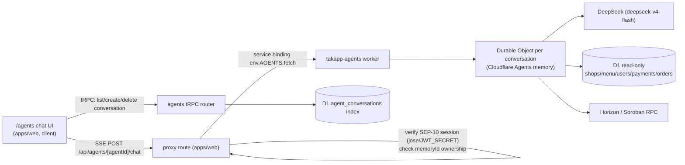

# TakApp AI Agents — TakAppAgent (v1) Implementation Plan

## Goal

Add a chat-based AI agent ("TakAppAgent") to the TakApp PWA. The agent is an expert on
TakApp, the TAK token, and coffee. It uses DeepSeek as the LLM and Cloudflare Agents
(Durable Object memory) to persist conversation history. The multi-worker split is invisible
to the user: the chat UI lives inside the existing PWA, and the browser talks only to the
same-origin `takapp.dev`.

## Locked decisions

1. **New package** `apps/agents` in the existing pnpm monorepo, deployed as a new worker
   `takapp-agents`. Not added to `apps/web` (OpenNext worker — mixing DOs is brittle) or
   `apps/bot` (Telegram-specific). Not a new repository.
2. **Framework**: use `@cloudflare/agents` (Durable Objects + built-in SQLite memory) as the
   source of truth for conversation history.
3. **Granularity**: one Durable Object per conversation; D1 (`agent_conversations`) only
   indexes conversations for the list UI. No full history duplicated in D1.
4. **Auth**: anonymous general Q&A allowed; personalized tools (balance, orders) require the
   existing SEP-10 session. Tenancy is enforced by the web worker proxy.
5. **Model**: `deepseek-v4-flash` for chat (with tool calling). `deepseek-v4-pro` reserved for
   the future Crypto agent.
6. **Transport**: SSE streaming through a same-origin proxy route in `apps/web`, forwarded to
   the agents worker via a Cloudflare **service binding** (`env.AGENTS.fetch`).
7. **Read-only v1**: no signing path, no writes to business data, LLM output treated as
   untrusted. No secrets ever enter prompts or agent memory.
8. **Agent registry is code-only** (like `appRouter` / the bot's intent map) for v1; no
   `agents` DB table until dynamic runtime management is needed.

## Out of scope (explicitly deferred)

- Crypto Market agent (leave a stub entry in the catalog).
- Web search (`SearchProvider`) — not needed by TakAppAgent v1.
- RAG knowledge base (static system prompt + live D1/Horizon tools now).
- Admin management of agents / runtime agent config in D1.
- Telegram MiniApp payment path.

## Architecture / data flow



- The web worker **owns** auth + the `agent_conversations` D1 index (writes via a new tRPC
  `agents` router). The agents worker owns DO memory and does **read-only** business-data
  access for tools (mirrors `apps/bot/src/db.ts` + `stellar.ts`).
- Conversation routing: the client calls `agents.createConversation` to get a `memoryId`
  (the DO id), then streams messages to `/api/agents/[agentId]/chat` with that `memoryId`.
  The proxy verifies the caller owns that `memoryId` before forwarding.

## Data model changes (`packages/shared/src/db/schema.ts`)

Add one table and export its type:

```ts
export const agentConversations = sqliteTable('agent_conversations', {
  id: integer('id').primaryKey({ autoIncrement: true }),
  userId: integer('user_id').references(() => users.id),        // null when anonymous
  anonymousKey: text('anonymous_key'),                           // device UUID for anonymous
  agentId: text('agent_id').notNull(),                           // e.g. 'takapp-agent'
  memoryId: text('memory_id').notNull().unique(),                // Durable Object id
  title: text('title'),
  createdAt: integer('created_at', { mode: 'timestamp_ms' }).notNull(),
  lastMessageAt: integer('last_message_at', { mode: 'timestamp_ms' }),
});
```

Enforce "exactly one of `userId` / `anonymousKey`" in app code (SQLite/Drizzle cannot express
the CHECK cleanly). The `memoryId` is the tenancy boundary: the proxy rejects a request whose
`memoryId` is not owned by the caller.

## Environment / config changes

- `apps/agents/wrangler.toml`: `name = "takapp-agents"`, D1 binding `DB` → `takapp-d1`
  (plus `takapp-d1-preview` under `[env.preview]`), `[vars]` for `DEEPSEEK_BASE_URL`,
  `HORIZON_URL`, `NETWORK_PASSPHRASE`, `SOROBAN_RPC_URL`, `TAK_CONTRACT_ID`, `APP_DOMAIN`.
  `DEEPSEEK_API_KEY` as a secret. Durable Object binding/migration for the agent classes.
- `apps/web/wrangler.toml`: add service binding to both default and `[env.preview]`:
  ```toml
  [[services]]
  binding = "AGENTS"
  service = "takapp-agents"
  ```
- `apps/web/src/server/trpc/env.ts` (`WorkerEnv`): add `AGENTS: Fetcher` (service binding
  type).

## Ordered tasks

1. **Scaffold `apps/agents`** — `package.json` (`@takapp/agents`, scripts mirroring
   `@takapp/bot`), `tsconfig.json`, ESLint flat config, `vitest.config.ts`, `wrangler.toml`.
   Deps: `@cloudflare/agents`, `@takapp/shared`, `openai`, `drizzle-orm`, `zod`,
   `@stellar/stellar-sdk`; dev: `wrangler`, `@cloudflare/workers-types`, `vitest`, etc.
2. **Config** — D1 binding + vars/secrets + DO bindings in `apps/agents/wrangler.toml`;
   add `AGENTS` service binding to `apps/web/wrangler.toml`.
3. **`apps/agents/src/env.ts`** — `AgentEnv` interface (DB, DEEPSEEK_API_KEY,
   DEEPSEEK_BASE_URL, Horizon/Soroban/TAK vars, optional internal-token secret).
4. **Read-only data access + Stellar reads** — `apps/agents/src/db.ts` (list active shops,
   get shop menu, find user by publicKey, list user payments/orders) and
   `apps/agents/src/stellar.ts` (balance reader). Reuse/adapt `apps/bot/src/stellar.ts`;
   prefer extracting the balance reader into `packages/shared` to avoid drift (adds
   `@stellar/stellar-sdk` to shared deps) — otherwise duplicate the ~50-line reader.
5. **DeepSeek adapter** — `apps/agents/src/llm/deepseek.ts`: `deepseek-v4-flash`, tool-calling
   (`tools` array), streaming on. Confirm the `@cloudflare/agents` model adapter shape at
   implementation time (wrap DeepSeek's OpenAI-compatible client as the agent's model, or call
   it directly inside the agent's run loop).
6. **System prompt + tools** — `apps/agents/src/prompt.ts` (brand voice + TAK facts: SEP-41,
   7 decimals, contract id, XLM support) and `apps/agents/src/tools/`:
   `listShops`, `getShopMenu`, `getTakTokenInfo`, `getUserBalance`, `getOrderHistory`
   (last two scoped to the authenticated `userId`; no-op/friendly refusal when anonymous).
   All read-only.
7. **Agent class + catalog** — `apps/agents/src/agents/takapp-agent.ts` (extends
   `AgentBase`, wires prompt + tools + memory) and `apps/agents/src/catalog.ts`
   (`{ 'takapp-agent': TakAppAgent }` with a stub `crypto-market` placeholder).
8. **Entry point** — `apps/agents/src/index.ts`: `routeAgentRequest`-style handler that maps
   `[agentId]` → catalog class and routes to the DO identified by `memoryId`, plus a `/health`
   endpoint. Trust `x-agent-user`/`x-agent-owner`/internal-token headers only from the service
   binding.
9. **Schema + migration** — add `agentConversations` to
   `packages/shared/src/db/schema.ts` + export type; run `pnpm db:generate` and
   `pnpm db:migrate` (local). Migrations dir lives in `apps/web/drizzle`.
10. **tRPC `agents` router** — `apps/web/src/server/trpc/routers/agents.ts`:
    `list` (authed → by userId; anonymous → by anonymousKey), `create` (authed or anonymous;
    returns `{ id, memoryId, agentId }`), `delete`, `rename`. Register in `router.ts`.
11. **Proxy route** — `apps/web/src/app/api/agents/[agentId]/chat/route.ts` (or
    `[...path]/route.ts`): verify `Authorization: Bearer` with the same jose HS256 +
    `JWT_SECRET` logic as `protectedProcedure` (`apps/web/src/server/trpc/trpc.ts`); resolve
    ownership of `memoryId`; inject `x-agent-user` (publicKey) or pass through
    `x-agent-owner` (anonymous key) + an internal shared token; forward to `env.AGENTS.fetch`
    and stream the response body through unchanged.
12. **Client** — `apps/web/src/lib/agents.ts` (SSE client via `fetch` + `ReadableStream`,
    using `getSessionToken()`/anonymous key from `storage.ts`); `apps/web/src/app/agents/page.tsx`
    (conversation list + thread + input; streaming tokens, markdown render). Add nav entry
    (`nav-bar.tsx`) and i18n strings (`en.ts` / `fa.ts`: `nav.agents` + chat labels).
13. **Model rename** — `apps/bot/src/llm/deepseek.ts`: switch `deepseek-chat` →
    `deepseek-v4-flash` (or confirm the alias), aligning bot and agents.
14. **Tests** — tool-calling parse, prompt-injection refusal for TakAppAgent, conversation
    tenancy (cross-user `memoryId` denied), proxy auth (missing/invalid/expired token → 401
    with anonymous fallback), tool failure degradation, rate-limit path.
15. **Docs** — update `ARCHITECTURE.md` (system-components diagram, deployment section,
    data-model list, new "Conversational agent" subsection) in the same change.

## Failure modes & edge cases

- **Missing/invalid/expired session** → proxy falls back to anonymous (no user header);
  personalized tools return a "log in to see that" refusal instead of erroring.
- **Unauthorized `memoryId`** → proxy returns 403 (tenancy breach attempt).
- **DeepSeek API error / timeout** → stream a friendly localized error; don't leak raw errors
  or keys.
- **Tool failure** (Horizon/Soroban down, shop missing) → degrade gracefully (like the bot's
  best-effort TAK read), never throw mid-conversation.
- **Rate limiting / cost abuse** → per-user message cap alongside existing login limits.
- **DO memory lost** (DO evicted/restored) → conversation index row remains but history is
  empty; the client shows an empty thread gracefully (acceptable for v1).
- **Prompt injection** → TakAppAgent holds real business data; treat LLM output as untrusted,
  tools are read-only and parameterized, no write/D1-mutation path exists from the agent.

## Validation plan

- `pnpm typecheck`, `pnpm lint`, `pnpm test` at repo root (monorepo-wide).
- Manual (`pnpm build` first, then `pnpm dev`): open `/agents`, start a conversation, verify
  SSE streaming, conversation list persistence across reloads, anonymous chat works, authed
  chat can ask "what's my balance?", and cross-user `memoryId` / tampered-token requests are
  rejected.
- Confirm the agents worker is not publicly reachable (no route) — only via service binding.

## Rollout & migration

- Additive schema change only (`agent_conversations`); no destructive migration.
- Deploy order: `takapp-agents` first (new worker), then `takapp-web` with the service binding
  + proxy route. Backward compatible: no existing flows change; the bot model rename is a
  no-downtime config change.

## Confirm at implementation start (non-blocking)

- Exact `@cloudflare/agents` API shape (agent base class, model adapter, `routeAgentRequest`,
  DO binding syntax, memory helpers) for the installed version — wire tasks 5/7/8 accordingly.
- Whether to extract the bot's balance reader into `packages/shared` vs duplicate (recommend
  extract).
- Whether `deepseek-chat` still aliases or must be pinned to `deepseek-v4-flash`.
