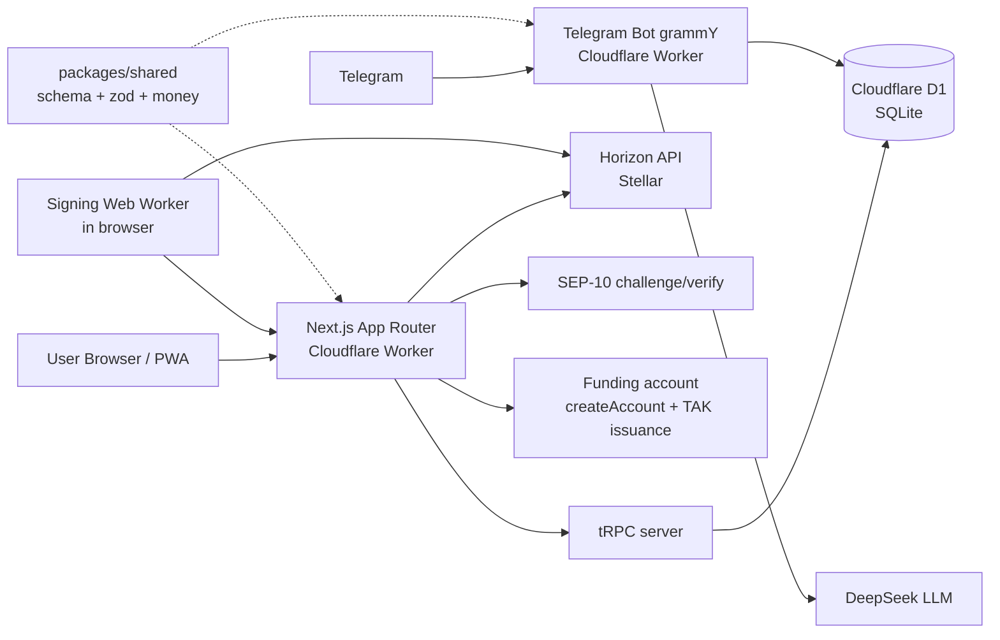

# TakApp Architecture

## Overview

TakApp is a **non-custodial** mobile-first PWA that lets users pay for coffee with the project's own **TAK** token on the Stellar blockchain. Users hold and control their own Stellar keys; the backend never stores or sees secret keys and can never move user funds.

A companion **Telegram bot** lets users ask read-only questions conversationally — "show my balance", "where can I pay?" — with **DeepSeek** translating natural language into a restricted, validated command set. Payment execution stays in the PWA until Telegram MiniApp work is scheduled.

The app runs on **Cloudflare Workers** using Next.js 15 (App Router) deployed through OpenNext, with **Cloudflare D1** (SQLite) as the database, **Drizzle** as the ORM, and **tRPC** as the sole client-server communication layer. The repo is a pnpm-workspaces monorepo: `apps/web` (PWA), `apps/bot` (Telegram bot), and `packages/shared` (Drizzle schema, zod schemas, money helpers, verification providers shared by both workers).

## Goals

- Let any user create a Stellar-backed wallet with only an email or phone number.
- Make paying for coffee in local shops as simple as tapping a button.
- Support **TAK** and **XLM** balances with a TAK trustline established on signup.
- Be fully functional offline for login, balance view, and payment flows.
- Support email, SMS, and Google Authenticator verification; only verified users receive free gifts.
- Give admins the ability to manage coffee shops; support a "coffee shop owner" role.
- Let users check balances, browse the shop list, and review history through a **read-only** Telegram bot assistant powered by natural language; payment execution stays in the PWA.

## Non-Goals

- Custodial storage of user funds or keys.
- Server-side signing of user transactions (the server never touches user balances).
- Support for other blockchains.

## Technology Decisions

| Decision | Rationale |
| --- | --- |
| pnpm workspaces monorepo (`apps/web`, `apps/bot`, `packages/shared`) | One repo, one lockfile; the Drizzle schema, zod schemas, and money helpers live in a package shared by both Cloudflare Workers. |
| Stellar + SEP-10 | SEP-10 is the standard challenge/response auth for Stellar; works without wallet extensions because signing happens in-browser with the user's own key. |
| Client-side key encryption (WebCrypto/PBKDF2) | Keys stay on device; the server only ever sees a public key and signed challenges. |
| Cloudflare Workers + D1 | Edge deployment with zero server management; D1 gives a free-tier relational DB co-located with the worker. |
| Next.js + tRPC | Type-safe end-to-end API; App Router + RSC fits Cloudflare's edge model via OpenNext. |
| `@serwist/next` | Manifest + service worker + offline shell generated from Next.js config; keeps the PWA offline-capable without a separate build step. |
| Tailwind CSS v4 | Utility-first styling with a PostCSS plugin (`@tailwindcss/postcss`); coffee-themed base palette. |
| Drizzle ORM | Lightweight, type-safe SQLite queries; schema doubles as the type source of truth. |
| BIP-39 12-word mnemonic | Standard, interoperable recovery phrase; derived seed regenerates the Stellar keypair. |
| Server-held funding account | Bounded zero-key exception: one secret (`FUNDING_SECRET`) funds new accounts and issues TAK; it can never sign user transactions or touch user balances. |
| Verification (TOTP first) | `otplib` TOTP implemented behind a pluggable `VerificationProvider` interface; email/SMS stubbed for v1. |
| Telegram bot (grammY, webhook) | Meets users in Telegram; webhook mode suits Workers (no long polling); grammY's Cloudflare Workers adapter runs as a Worker `fetch` handler. |
| DeepSeek via `openai` SDK | Cheap, capable natural-language parsing; `baseURL: https://api.deepseek.com`, model `deepseek-chat`; output is treated as untrusted and mapped to a restricted read-only command set. |

## System Components

- **Client (PWA)**: Next.js app with service worker (`@serwist/next`); stores the encrypted secret key and recovery phrase locally (IndexedDB/localStorage, WebCrypto). Transaction signing runs in a dedicated Web Worker so signing never blocks the UI.
- **tRPC server**: All communication (auth, wallet, coffee-shop, admin) goes through tRPC procedures hosted in the Worker.
- **Telegram bot (grammY)**: A separate Cloudflare Worker receiving Telegram webhooks via grammY's `webhookCallback(..., 'cloudflare')`. It forwards user messages to DeepSeek, parses the result into a restricted **read-only** command set (balance, shops, history), and executes those commands against D1. There is no signing path in the bot.
- **DeepSeek**: Natural-language intent parser. It is stateless and returns structured intent only (no free-form execution); prompts never receive secret keys or signed data.
- **Funding account**: A single server-held Stellar key (`FUNDING_SECRET`, env only) that funds new accounts (`createAccount`) on signup and issues TAK. It never signs user transactions and never touches user balances.
- **packages/shared**: Drizzle schema, stroop money helpers, zod schemas, and verification providers shared by the web and bot workers; the schema is the single source of truth for DB types.
- **D1 database**: SQLite via Drizzle; holds users, sessions, verification state, Telegram bindings, conversations, coffee shops, payments, and gifts.
- **Stellar (Horizon)**: Reads balances, submits payments/trustline operations. The server only submits operations for its own accounts (e.g., TAK issuance, account funding) — never for user accounts.

## Authentication & Key Management

### Sign Up

1. User provides email or phone number + password.
2. Client derives an encryption key from the password (PBKDF2, high iteration count) and generates a Stellar keypair.
3. The secret key is encrypted and stored in browser storage only. The 12-word mnemonic is shown once for recovery (never persisted server-side).
4. The server creates a user row keyed by the Stellar **public key**; it never sees the secret.
5. The server funds the new account from the funding account (`createAccount`), and the client establishes the TAK trustline; the server confirms account activation on-chain.

### Login (SEP-10)

1. Server generates a SEP-10 challenge transaction containing a nonce.
2. Client decrypts the secret key and signs the challenge **in the browser** (Web Worker).
3. Server verifies the signature against the stored public key and issues a signed token (SEP-10 JWT).
4. Token authorizes subsequent tRPC calls. Offline mode caches the token and balances for the PWA shell.

### Recovery

- The 12-word mnemonic (BIP-39) regenerates the keypair; the user re-encrypts the restored key with a (possibly new) password.

### Verification (pluggable providers)

- **Email**, **SMS**, and **Google Authenticator (TOTP)** providers behind a common `VerificationProvider` interface in `packages/shared`.
- Each provider is independent: one-time codes are verified and marked in D1.
- v1 ships the **TOTP** provider (via `otplib`) fully implemented; email/SMS are stubbed behind the same interface.
- Only users with at least one completed verification are eligible for free gifts.

## Data Model (initial)

> The Drizzle schema lives in `packages/shared/src/db/schema.ts` and is the single source of truth for DB types; app code derives `typeof` types from it.

- `users` — id, stellar public key (unique), email/phone (unique, nullable), display name, password hash (PBKDF2-SHA256), verification state.
- `sessions` — SEP-10 token / nonce tracking, expiry.
- `verifications` — type (email/sms/totp), identifier, status, one-time code digest, expiry.
- `telegram_bindings` — user id, telegram user id (unique), telegram username, bound/authorized at, last seen.
- `conversations` — user id, telegram chat id, short-lived context window for bot replies (no secrets, expiry enforced).
- `coffee_shops` — id, owner user id, name, address, active status, editable by admins.
- `payments` — id, user id, coffee shop id, amount (string, stroops), asset (TAK/XLM), tx hash, status, timestamp.
- `gifts` — issued free gifts for verified users.

Money amounts are stored as **strings** in stroops (1 lumen = 10,000,000 stroops). No floats anywhere.

## Key Flows

### Account activation

1. On signup, the server uses the funding account (`FUNDING_SECRET`, env only) to submit a `createAccount` transaction funding the new user's public key with the minimum XLM balance.
2. In local development the funding account itself is funded first via **Friendbot** on testnet; there is no Friendbot equivalent on mainnet.
3. The funding account also issues TAK (trustline first). It is the only server-held key and is never used for user transactions.

### Pay for coffee

1. User scans/selects a shop; app reads TAK balance from Horizon (or cached balance offline).
2. User confirms; client signs the payment transaction in the Web Worker with the decrypted key.
3. Transaction is submitted to Horizon directly from the client; the server never signs or submits it.
4. The server records the payment after observing it on-chain (or the client reports the tx hash for indexing).

### Admin / owner

- Admins create/edit/disable coffee shops via tRPC admin procedures.
- Coffee shop owners manage their own shop(s) and view payment history.
- Admin and owner permissions never grant access to user balances or keys.

### Conversational assistant (Telegram bot, read-only for v1)

1. User sends natural language to the bot (e.g., "show my balance", "where can I pay?").
2. The bot checks the Telegram identity is bound and authorized; unbound users are prompted to link their account.
3. The message is sent to DeepSeek with a strict prompt that yields a **structured intent** (action, optional shop) — never free-form instructions.
4. The bot validates the intent against a fixed read-only command allow-list (`balance`, `shops`, `history`) and the user's permissions, then executes it against D1.
5. Read-only actions require no signing. Payment execution stays in the PWA until Telegram MiniApp work is scheduled (future bot-payment path).
6. LLM prompts and replies never contain secret keys, recovery phrases, or signed transactions.

## Security Model

- **Zero-knowledge keys**: the server stores only public keys. Secret keys, mnemonics, and derived encryption material never leave the device.
- **Funding account (bounded exception)**: the server holds exactly one Stellar secret key (`FUNDING_SECRET`, env only). It funds new accounts (`createAccount`) and issues TAK — nothing else. It can never sign user transactions or touch user balances; the exception is documented and bounded in code.
- **SEP-10 challenge** is single-use, time-limited, and bound to the user's public key; tampered or replayed challenges are rejected (covered by tests).
- **Password storage**: hashed with PBKDF2-HMAC-SHA256 (600k iterations, Web Crypto) on the server for the account password; the derived encryption key is salted/iterated PBKDF2 on the client.
- **Rate limiting** on login, verification-code resend, and challenge issuance.
- **Bot authorization**: read-only wallet queries from Telegram run only for users whose Telegram identity is bound and authorized; bindings can be revoked. The bot has no signing path.
- **LLM as untrusted input**: DeepSeek output is parsed into a restricted, validated read-only command set; free-form LLM text can never drive privileged actions or reach the signing path.
- Admin procedures enforce role checks server-side; no privileged logic in client bundles.
- D1 writes are transactional and batched to respect worker/D1 limits.

## Deployment

- Cloudflare Worker hosting the Next.js app via OpenNext (`@opennextjs/cloudflare`).
- A second Cloudflare Worker hosting the Telegram bot webhook (grammY, `webhookCallback(..., 'cloudflare')`); the Telegram webhook URL is registered via Bot API.
- Both workers share `packages/shared` (schema, zod schemas, money helpers, verification providers).
- D1 database with Drizzle migrations applied via `pnpm db:generate` / `pnpm db:migrate` (local first, remote explicitly).
- PWA manifest + service worker (`@serwist/next`) generated at build time; core assets cached for offline use.
- Environment variables hold Horizon URL, network passphrase (testnet in dev, public in prod), SEP-10 settings, `FUNDING_SECRET`, TAK issuer, `BOT_TOKEN`, and `DEEPSEEK_API_KEY` — never user keys.

## Testing Strategy

- **Vitest** unit tests: crypto/key derivation, mnemonic round-trip, SEP-10 challenge verify/reject (expired, tampered, wrong key), intent parsing (valid/invalid/ambiguous/malicious input).
- **Integration tests**: tRPC procedures with a local D1/Drizzle instance; failure paths (insufficient funds, wrong password, expired challenge, tampered request, unbound or revoked Telegram identity).
- Client signing logic tested against the Web Worker interface with mocked Horizon.
- Every change touching balances, keys, auth, or bot actions ships with failure-path tests.

## Related Documents

- `AGENTS.md` — contribution guide, commands, conventions.
